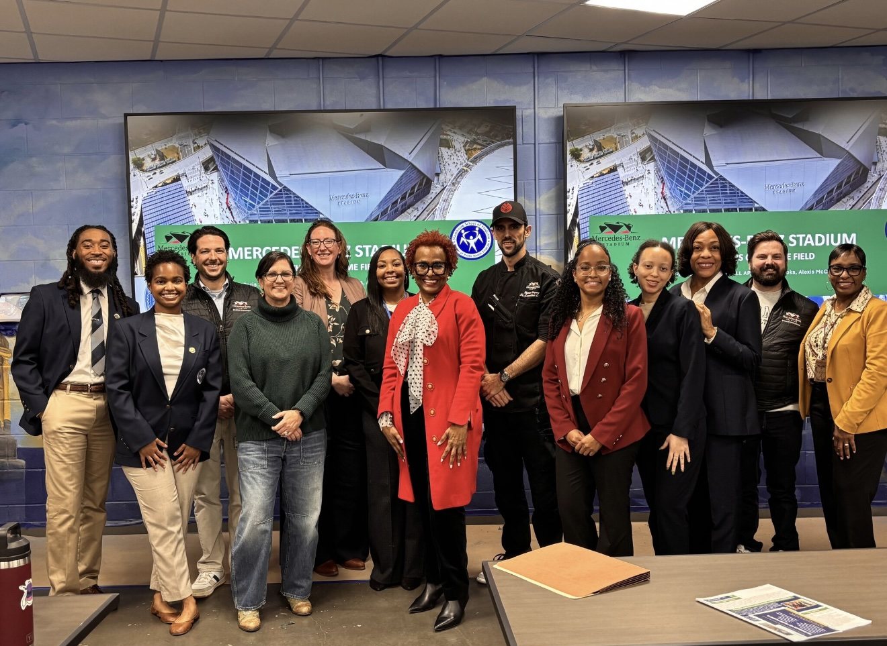

::: page-content
# [Presentations and Projects]{style="color:#440712; display:block; text-align:center;"}

## [Presentations]{style="color:#7A0C2D; display:block; text-align:center;text-decoration:underline;"}

### Determinants of Self-Reported Coronary Artery Disease Prevalence Among U.S. Adults

**Abstract Poster Presentation**\
*American Public Health Association Annual Meeting*\
Washington, D.C. \| November 2025

```{=html}

```

### USGBC Women in Green Georgia Panel

**Panelist**\
*United States Green Building Council Women in Green Georgia*\
Atlanta, GA \| September 2025

```{=html}

```

### Bridging Environmental and Public Health: Partnerships for Positive Impact

**Speaker**\
*Green Sports Alliance Annual Meeting*\
Miami, FL \| June 2025

```{=html}

```

<br> <br>

## [Projects]{style="color:#7A0C2D; display:block; text-align:center; text-decoration:underline;"}

### Digital Community Health Dashboard

**Data Dashboard, Center of Excellence on Environmental Health and Sustainability, Morehouse School of Medicine**\
*May 2024-Present*\

-   Maintained interactive <a href="https://www.dashboard.communitieswhoknow.com/Home/" target="_blank">dashboard</a> integrating datasets on demographics, health outcomes, and environmental indicators.\
-   Enhanced accessibility of public health insights for community partners and residents.\

### Health is Our Homefield **Stakeholder Presentation, Mercedes-Benz Stadium, Atlanta, GA**

*Aug 2025 -Dec 2025*\

-   Principal Investigator (PI); led and mentored student research team.\
-   Presented findings of directed study that examined the health impacts of Mercedes-Benz Stadium’s sustainable practices to leadership.\

```{=html}

```

:::
